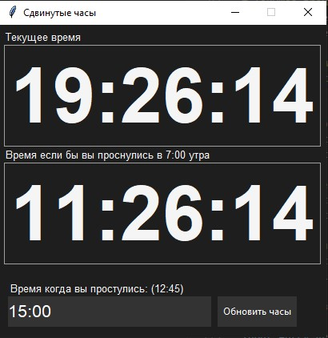

# Shifted Clock

### Описание
Shifted Clock — это приложение, созданное для людей с нарушенным графиком сна. Оно позволяет пользователю ввести реальное время пробуждения и смещает его так, как будто он проснулся в 7 утра. Приложение помогает отслеживать реальное и смещенное время, что позволяет пользователю лучше ориентироваться в том, когда следует ложиться спать.

### Как пользоваться
1. Укажите время, когда вы проснулись, в формате `15:45`.
2. Нажмите кнопку «Обновить часы».

Приложение отобразит текущее реальное время и скорректированное время, как если бы вы проснулись в 7 утра.

